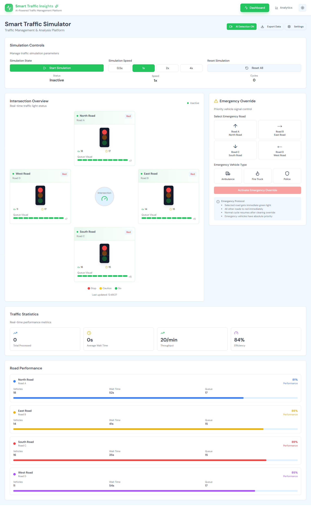
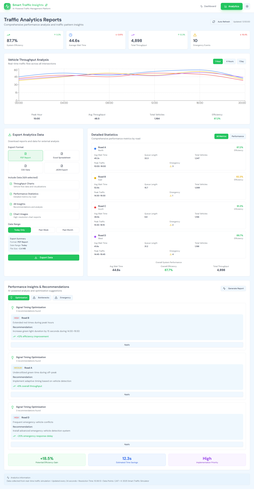

# 🚦 Smart Traffic Insights Simulator  
**AI-Powered Real-Time Traffic Management & Analytics Platform**

[](https://smart-traffic-insights-simulator-u7mw450v.sites.blink.new/)  
[](LICENSE)

---

## 📘 Overview
The **Smart Traffic Insights Simulator** is an intelligent, data-driven traffic management system designed to analyze, simulate, and optimize urban road traffic using **AI camera detection sensors**.  
It enables **real-time monitoring**, **data analytics**, and **report generation** to help city planners, researchers, and authorities improve traffic efficiency and reduce congestion.  

---

## 🧠 Key Features
- 🚘 **AI Detection Camera Sensors** for real-time vehicle tracking and density analysis  
- 📊 **Interactive Dashboard & Analytics Reports** with live throughput and efficiency metrics  
- 🌗 **Dark & Light Mode** support for better user accessibility  
- 📈 **Export Options** — PDF, Excel, CSV, and JSON formats  
- 🧩 **Performance Insights & Recommendations** powered by AI  
- 🚨 **Emergency Vehicle Override** for prioritizing critical services  
- ⚡ **Real-Time WebSocket Communication** between simulator and analytics  
- 💾 **Database Integration** for persistent storage and trend analysis  

---

## 🧰 Tech Stack

| Layer | Technology |
|:------|:------------|
| **Frontend** | React, TypeScript, TailwindCSS, Vite |
| **Backend** | Java Spring Boot |
| **Database (Cloud)** | Supabase (PostgreSQL) |
| **AI / Real-Time Layer** | WebSocket + Camera Detection Logic |
| **Data Export** | PDF, Excel, CSV, JSON |
| **Hosting** | Blink Sites (Web) + Localhost API |

---
## 🏗️ Architecture Overview

|**Frontend** (React + Vite) → REST API (Spring Boot) → Supabase (PostgreSQL Cloud) |
|                            | ↳ WebSocket → Real-time Sensor Stream |

---

## 🖥️ Screenshots

### 🔹 Smart Traffic Simulator (Dashboard)


### 🔹 Traffic Analytics Reports


> *Simulated data visualizations include throughput, system efficiency, emergency detection, and signal optimization insights.*

---

## 🚀 Live Demo
Try the live version here:  
🔗 **[Smart Traffic Insights Simulator](https://smart-traffic-insights-simulator-u7mw450v.sites.blink.new/)**

---

## ⚙️ Installation & Setup

### Prerequisites
- Node.js (v18+)
- Java JDK (v17+)
- MySQL or PostgreSQL
- Maven

### Frontend Setup
```bash
cd frontend
npm install
npm run dev
```

### Backend Setup
```bash
cd backend-java
mvn spring-boot:run
```

The app will be available at:  
`http://localhost:5173` (Frontend)  
`http://localhost:8080` (Backend API)

---

## 📂 Folder Structure

```
Final-Smart-Traffic-Simulator/
├── frontend/                 # React + TypeScript + Vite + Tailwind
│   ├── components/
│   ├── pages/
│   ├── public/
│   └── ...
├── backend-java/             # Spring Boot Backend
│   ├── src/main/java/com/smarttraffic/
│   ├── controller/
│   ├── config/
│   └── pom.xml
└── database/                 # SQL setup files
```

---

## 🧾 System Highlights
- **Real-Time Data Visualization** — Live metrics of vehicle throughput, queue lengths, and system efficiency  
- **AI-Based Recommendations** — Suggests optimal signal timings and congestion relief strategies  
- **Emergency Management** — Overrides signals for priority vehicles (Ambulance, Fire Truck, Police)  
- **Exportable Reports** — Generate performance reports for external analysis  

---

## 🧑‍💻 Team Members

| Name | Register Number |
|------|-----------------|
| **Arhan Ashraf** | RA2411030010039 |
| **Peter Jijo Manavalan** | RA2411030010045 |
| **K.A. Abhinav** | RA2411030010056 |
| **Arjun Anil** | RA2411030010020 |

### 🧭 Guide
**Dr. R. Sujatha**  
Department of Networking and Communication (NWC)  
SRM Institute of Science and Technology  

---

## 🌍 Sustainable Development Goal Alignment
This project aligns with **UN SDG 11: Sustainable Cities and Communities**, by promoting intelligent transportation systems, reduced congestion, and efficient mobility solutions.

---

## 📜 License
This project is licensed under the **MIT License** — feel free to use and modify it for academic and research purposes.

---

## ⭐ Acknowledgments
Special thanks to **SRM Institute of Science and Technology** for providing guidance and resources to develop this project.  
Developed as part of **21CSC203P – Advanced Programming Practice** (November 2025).

---

© 2025 Smart Traffic Insights Simulator Team
